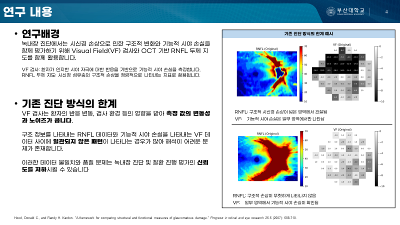

# AI Transformation Portfolio

안녕하세요. 데이터와 인공지능을 활용해 실제 문제를 정의하고 해결하는 AI 전공 석사과정 이지원입니다.

본 저장소는 대학원 연구 및 프로젝트 경험을 정리한 포트폴리오입니다. 실제 데이터의 노이즈, 변동성, 도메인 특성을 이해하고 AI 모델 및 분석 파이프라인으로 개선한 사례를 중심으로 구성했습니다.

## Portfolio

📄 [포트폴리오 PDF 보기](./GITHUB_PORTFOLIO_korean.pdf)

---

## Profile

- M.S. Candidate in AI, Pusan National University
- B.S. in Environmental Engineering, Minor in Computer Science
- Research Interests: Machine Learning, Deep Learning, Medical AI, Multimodal Data Analysis, LLM
- GitHub: https://github.com/2z1-0ne

---

## Main Projects

### 1. RNFL-Guided Visual Field Denoising

SS-OCT RNFL 구조 정보를 활용해 24-2 시야검사 데이터의 노이즈를 줄이는 딥러닝 기반 디노이징 모델을 개발했습니다.

- 24-2 시야검사 데이터와 SS-OCT RNFL thickness map을 1:1 매칭
- 데이터 품질 기준 설정 및 전처리 수행
- CNN 기반 feature extraction 및 Residual MLP 기반 회귀 모델 설계
- Gaussian NLL, spatial smoothness, rank consistency loss를 활용한 학습 구조 설계
- 원본 VF와 denoised VF를 비교하여 머신러닝 분류 성능 및 안정성 평가
- 2025 한국소프트웨어종합학술대회 인공지능 응용 분야 우수발표논문상 수상

### 2. Glaucoma Visual Field Pattern Analysis

녹내장 환자의 시야검사 데이터에서 질환 진행 패턴을 분석하기 위한 비지도학습 기반 연구에 참여했습니다.

- 24-2 및 10-2 visual field 데이터 분석
- Archetypal Analysis, Fuzzy C-Means 기반 패턴 분해
- 시야검사 데이터 품질 기준 적용 및 전처리
- 질환 진행 패턴 탐색 및 머신러닝 기반 예측 분석
- 임상 데이터 기반 결과 해석 및 연구 결과 정리 참여

### 3. Wide-field SS-OCT Structural Pattern Analysis

Wide-field SS-OCT 기반 안과 영상-derived 데이터를 활용하여 녹내장 구조적 손상 패턴을 분석하는 연구에 참여했습니다.

- SS-OCT 기반 GCL++ thickness map 데이터 분석
- 고차원 이미지-derived 정량 데이터 전처리
- 비지도학습 기반 구조 패턴 탐색
- 녹내장 중증도 및 진행과 관련된 structural pattern 분석
- 도메인 전문가와 함께 임상적 해석 과정 참여

### 4. BERT-Based Prediction Using Tabular Clinical Data

전자의무데이터 기반 급성 심근경색 예측을 위한 BERT 기반 모델 실험을 수행했습니다.

- 정형 의료 데이터를 Transformer 계열 모델에 적용
- 수치형 column을 embedding하여 BERT 입력으로 활용
- In-hospital, 6-month, 12-month mortality prediction 수행
- 기존 머신러닝 모델 및 Transformer 기반 접근과 성능 비교
- 정형 데이터에 LLM/Transformer 구조를 적용하는 가능성 탐색
- 📄 [report 보기](./BERT_report.pdf)

---

## Publications

### Journal Articles

1. **Fuzzy clustering of 24-2 visual field patterns can detect glaucoma progression**  
   *PLOS ONE, 19(9): e0309011, 2024*  
   Role: Co-author  
   - 24-2 시야검사 데이터에서 녹내장 진행 패턴을 분석하기 위한 머신러닝 기반 클러스터링 연구
   - 데이터 전처리, 패턴 분석, 통계 분석 및 결과 해석 과정 참여  
   - Code: https://github.com/2z1-0ne/glaucoma_VF

2. **Enhancing central visual field loss representation with a hybrid unsupervised approach**  
   *International Ophthalmology, 45, 317, 2025*  
   Role: Co-author  
   - 10-2 중심 시야검사 데이터의 손실 패턴을 표현하기 위한 비지도학습 기반 연구
   - Archetypal Analysis와 Fuzzy C-Means를 결합한 hybrid unsupervised approach 활용
   - 데이터 변동성을 고려한 패턴 탐색 및 성능 검증 과정 참여

3. **Unsupervised Classification of Wide-field Swept-Source Optical Coherence Tomography Reveals Structural Patterns Associated with Glaucoma Severity and Progression**  
   *Translational Vision Science & Technology, Submitted, 2025*  
   Role: Co-author  
   - Wide-field SS-OCT 기반 구조적 손상 패턴 분석 연구
   - 이미지-derived 정량 데이터 전처리 및 비지도학습 기반 패턴 분석 참여
   - 녹내장 중증도 및 진행과 관련된 구조적 패턴 해석 과정 참여

---

## Conference Presentation

1. **녹내장 정밀 진단을 위한 RNFL 기반 시야검사 디노이징 기법**  
   *2025 한국소프트웨어종합학술대회, 2025.12.16*  
   Role: First author  
   - SS-OCT RNFL 구조 정보를 활용해 24-2 시야검사 데이터의 노이즈를 줄이는 딥러닝 기반 디노이징 모델 제안
   - 데이터 매칭, 전처리, 모델 설계, 성능 평가까지 end-to-end 수행
   - KSC 2025 인공지능 응용 분야 우수발표논문상 수상

---

## Awards

- **KSC 2025 우수발표논문상**
  - Organization: 한국정보과학회
  - Date: 2026.01
  - Category: 인공지능 응용 분야
  - Paper: 녹내장 정밀 진단을 위한 RNFL 기반 시야검사 디노이징 기법

---

## Intellectual Property

1. **[Patent] 노이즈가 저감된 시야검사 결과 데이터를 제공하는 인공지능 모델을 이용 및 학습시키기 위한 전자 장치와 그 방법**
   - Country: Korea
   - Role: Main inventor
   - Application date: 2025.12.15

2. **[Copyright] 녹내장정밀진단을 위한 RNFL 기반 시야검사 디노이징 기법**
   - Country: Korea
   - Role: Main author
   - Registration date: 2025.11.16

---

## Research Experience

### Stanford University Visiting Researcher

PNU AI Global Research Program을 통해 Stanford University 공동 연구 프로그램에 참여했습니다.

- Period: 2025.07 - 2025.08
- Healthcare AI 및 유전체 데이터 분석 연구 수행
- Human genome structural variation detection 연구 참여
- ARC-SV 오픈소스 분석 도구 설치 및 실행 환경 구축
- Human reference genome 구축 및 BAM 데이터 전처리 수행
- 한국인 대용량 유전체 데이터 기반 structural variation 탐지 및 분석 경험

---

## Research Projects

- 체세포 구조적 변이 기반 심뇌질환 기전 및 상관진행 규명과 mRNA 기반 신약 후보물질 설계를 위한 정밀의료 AI 플랫폼 개발
- 딥러닝 기반 타겟 및 화합물 초고성능 가상탐색 웹플랫폼 개발
- AI-POCT 기반 Screening & Care Solution 개발을 통한 지역사회 건강노화 플랫폼 구축
- 산업융합형 멀티모달 생성 인공지능 인재양성

---

## Skills

### Programming

- Python
- R
- Java
- C / C++

### Machine Learning / Deep Learning

- PyTorch
- TensorFlow / Keras
- Scikit-learn
- CNN
- VAE
- Diffusion
- Transformer
- BERT

### NLP / LLM

- Hugging Face
- BERT fine-tuning
- Transformer-based modeling
- LLM fundamentals
- Text classification

### Data Analysis

- Data preprocessing
- Medical data analysis
- Statistical analysis
- Model evaluation
- Visualization
- Pattern analysis
- Multimodal data matching

### Collaboration & Communication

- Research presentation
- Teaching assistant experience
- Cross-domain collaboration with medical researchers
- Technical documentation
- AI concept explanation for non-specialists

---

## Contact

- Email: dlwldnjs4324@naver.com
- Email: jiwon_lee@pusan.ac.kr
- GitHub: https://github.com/2z1-0ne
